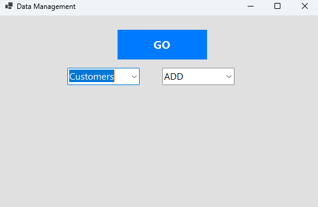
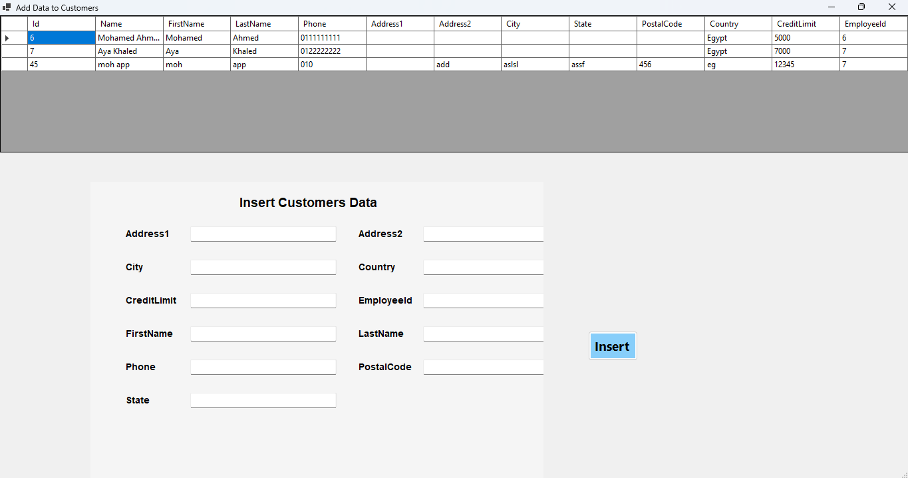
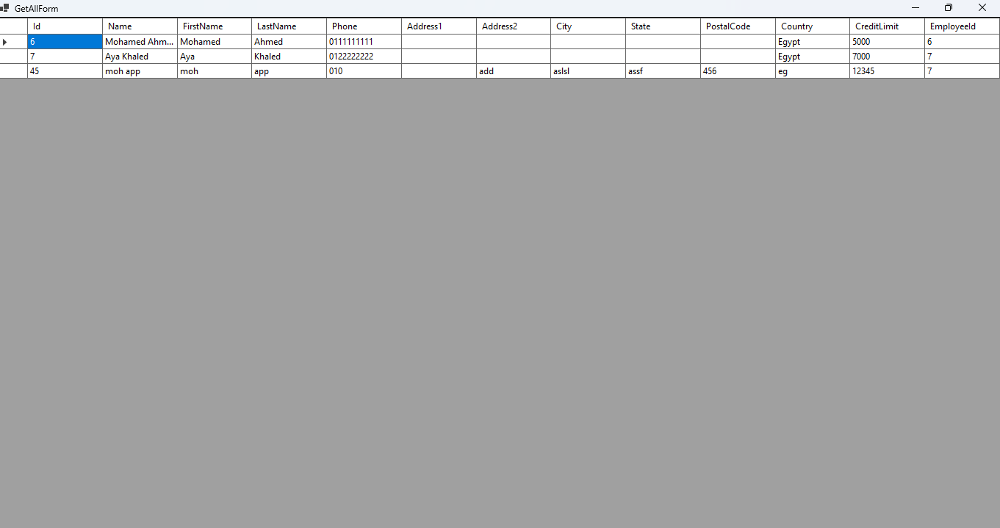
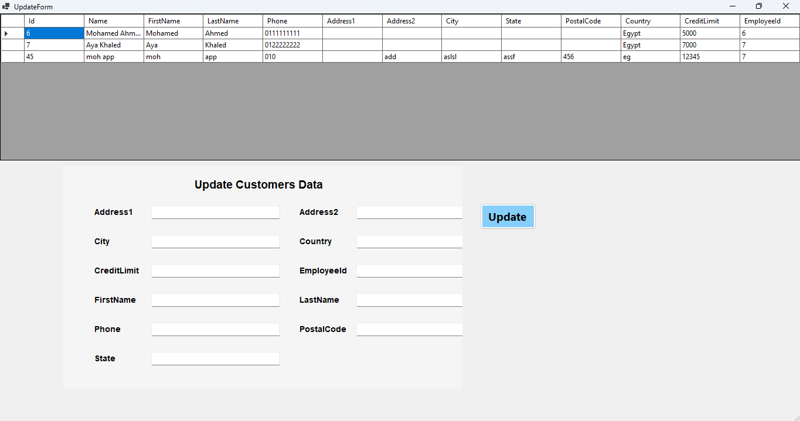
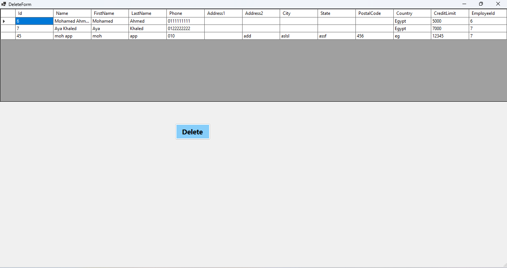

# EFProject - Entity Framework CRUD Application


A comprehensive Windows Forms application for database management with full CRUD functionality using Entity Framework.

## Table of Contents
- [Features](#features)
- [Supported Database Tables](#supported-database-tables)
- [Solution Structure](#solution-structure)
- [Getting Started](#getting-started)
  - [Prerequisites](#prerequisites)
  - [Installation](#installation)
- [Usage Guide](#usage-guide)
  - [Main Interface](#main-interface-form1cs)
  - [CRUD Operations](#crud-operations)
- [Technical Details](#technical-details)
- [Key Components](#key-components)
- [Screenshots](#screenshots)

## Features

- **Complete CRUD Operations**: Create, Read, Update, and Delete records
- **Multi-Table Support**: Works with 8 different database tables
- **Dynamic UI Generation**: Auto-creates forms based on table schema
- **Data Visualization**: Clean tabular display with auto-sizing columns
- **Entity Framework Integration**: Robust data access layer

## Supported Database Tables

1. Customers
2. Orders
3. Products
4. ProductLines
5. Order_Products (junction table)
6. Payments
7. Offices
8. Employees

## Solution Structure

```
EFProject/
├── Context/               # Database context
│   └── PrContext.cs       # DbContext configuration
├── Migrations/            # Database migration files
├── Models/                # Entity classes
├── Utils/                 # Utility functions
│   └── Utils.cs           # Core helper methods
├── AddForm.cs             # Record creation form
├── DeleteForm.cs          # Record deletion form
├── Form1.cs               # Main application controller
├── GetAllForm.cs          # Data viewing form
├── Program.cs             # Application entry point
└── UpdateForm.cs          # Record modification form
```

## Getting Started

### Prerequisites

- Visual Studio 2022 or later
- .NET 6.0 or higher
- SQL Server (LocalDB included with Visual Studio works)
- Entity Framework Core packages

### Installation

1. Clone the repository:
   ```bash
   git clone https://github.com/mohamedAbdelwahabali5/EFProject.git
   ```

2. Restore NuGet packages:
   ```
   dotnet restore
   ```

3. Configure the database:
   - Update connection string in `PrContext.cs`
   - Run migrations if needed:
     ```bash
     dotnet ef database update
     ```

## Usage Guide

### Main Interface (Form1.cs)

1. **Table Selection**:
   - Dropdown lists all available tables
   - Automatically populated from DbContext

2. **Operation Selection**:
   - ADD: Create new records
   - GET ALL: View all records
   - UPDATE: Modify existing records
   - DELETE: Remove records

3. **Execution**:
   - Click "GO" to launch the appropriate form

### CRUD Operations

#### Adding Records (AddForm.cs)
- Dynamically generated input fields
- Automatic data type handling
- Success/failure feedback

#### Viewing Data (GetAllForm.cs)
- Tabular display with auto-resizing
- Full dataset visualization
- Read-only interface

#### Updating Records (UpdateForm.cs)
- Pre-populated existing values
- Field-level modification
- Data validation

#### Deleting Records (DeleteForm.cs)
- Confirmation dialogs
- Referential integrity checks
- Success notifications

## Technical Details

- **Architecture**: Model-View-Presenter (MVP) pattern
- **Data Access**: Entity Framework Core 6.0
- **UI Framework**: Windows Forms (.NET 6)
- **Dependency Management**: NuGet package system

## Key Components

### Utils.cs

```csharp
public static void LoadDataFromDB(string tableName, PrContext db, DataGridView allData)
{
    // Dynamically loads data based on table name
    // Handles all supported tables
    // Configures DataGridView display
}

public static void GenerateInsertFields(string tableName, Panel panel, PrContext db, string operation)
{
    // Creates input fields dynamically
    // Handles different data types
    // Automatic layout management
}
```

### Form1.cs (Main Controller)

```csharp
private void go_Click(object sender, EventArgs e)
{
    // Routes to appropriate CRUD form
    // Handles table/operation selection
    // Manages form instances
}
```

## Screenshots







